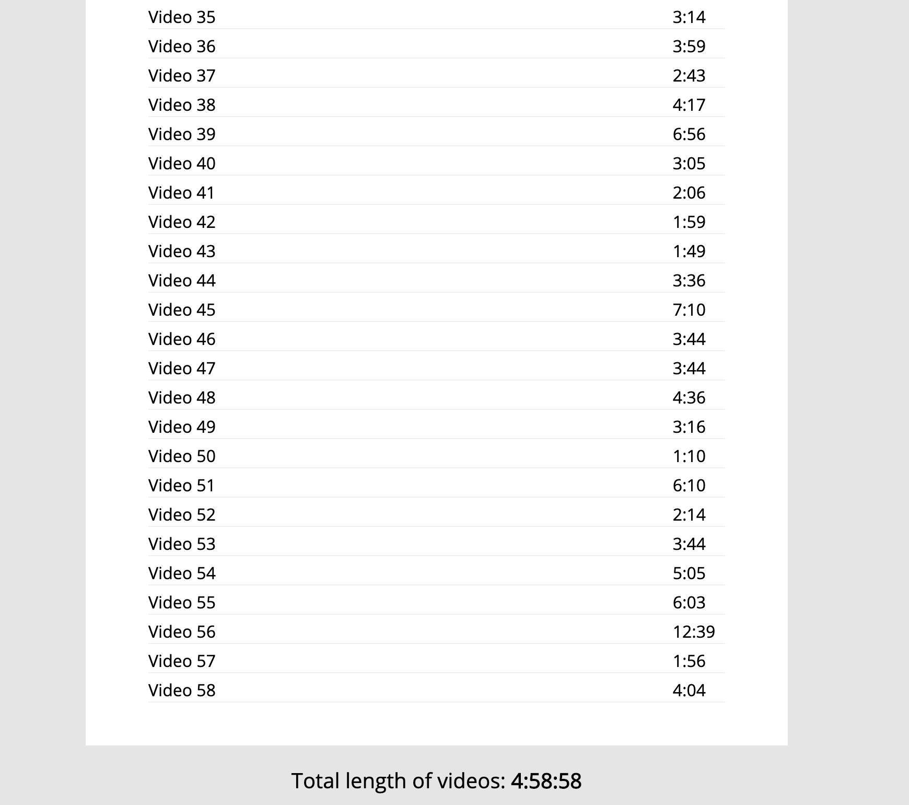

# 18. Adding Up Times With Reduce

#### _Adding Up Times With Reduce by JavaScript30 10/20/19_

## Description
This is Adding Up Times With Reduce, 18th application out of 30 by 30 day Vanilla JavaScript Coding Challenge by Wes Bos.<br>
Please check the challenge from [JavaScript30](http://wesbos.com/javascript30/).




## About this Application:
- Calculating total video length using `.reduce()` method.
- Showing each video length using `.map()` method.

## Setup/Installation

1. Clone this repo:
```
$ git clone https://github.com/misakimichy/JS30-18-adding-up-times-with-reduce.git
```

2. Navigate to the top level of the cloned directory.

3. Open `index.html` with your preferred web browser.

## Known Bugs
* No known bugs at this time.

## Support and contact details
 I welcome any feedbacks and comments: misaki.koonce@gmail.com

## Technologies Used
_Git, GitHub, HTML, CSS, Vanilla JavaScript

## License
Copyright © 2019 under the MIT License